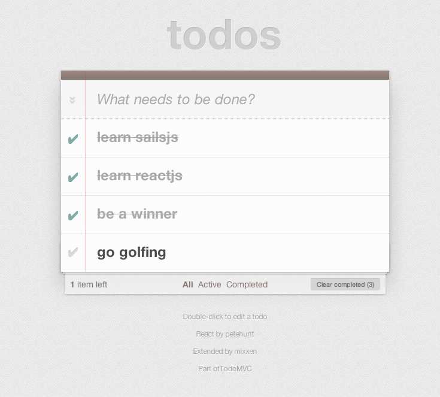

# Sails.js + React.js Examples

Inspired by the React.js tutorials, these examples shows ways to integrate Sails.js as the real time persistent backend model to a React.js frontend. 
Two examples are provided: a markdown chat application and the TodoMVC application. Both showcasing the real time capabilities for multiple clients.

#### References
* [Sails Tutorial](https://www.youtube.com/watch?v=uxojCaDSyZA)
* [React Tutorial](http://facebook.github.io/react/docs/tutorial.html)
* [React Animation](http://facebook.github.io/react/docs/animation.html)
* [React TodoMVC](https://github.com/tastejs/todomvc/tree/gh-pages/architecture-examples/react)
* [RequireJS](http://requirejs.org/)

## Run Instructions

#### Prerequisites
* git
* [nodejs](http://nodejs.org)
* [npm](http://npmjs.org)
* [bower](http://bower.io)


```bash
git clone https://github.com/mixxen/sails-react-example.git
cd sails-react-example
npm install
bower install
node app.js
open http://localhost:1337 (open multiple windows to see real time capabilities of Sailsjs)
```

## Start from Scratch
1. Install Sails

   ```
   sudo npm -g install sails
   ```

2. Create new Sails project

   ```
   sails new sails-react-example
   ```

3. Change directory to ```sails-react-example```

4. Install grunt-babel

   ```
   npm install grunt-babel babel-preset-es2015 babel-preset-react --save
   ```

4. Edit ```compileAssets.js syncAssets.js config/babel.js``` to support jsx files

5. Install bower and add components (see ```bower.json```)

  ```
  npm install bower --save
  ```

6. Create ```assets/styles/styles.css``` for styles and animation css 

7. Create models and controllers

   ```
   sails generate comment
   ```
8. Edit ```views/xxx.ejs``` and put ```<div class="container" id="myComponent"></div>``` somewhere

9. Be sure to call ```ReactDOM.render``` somewhere and reference the div in previous step. Example:

   ```javascript
   ReactDOM.render(
     <CommentBox url="/comment" data={message} />,
     document.getElementById('myComponent')
   );
   ```

## Screenshots



## Todo

* Webpack instead of RequireJS (see [react-webpack-express](https://github.com/mixxen/react-webpack-express) for express boilerplate)
